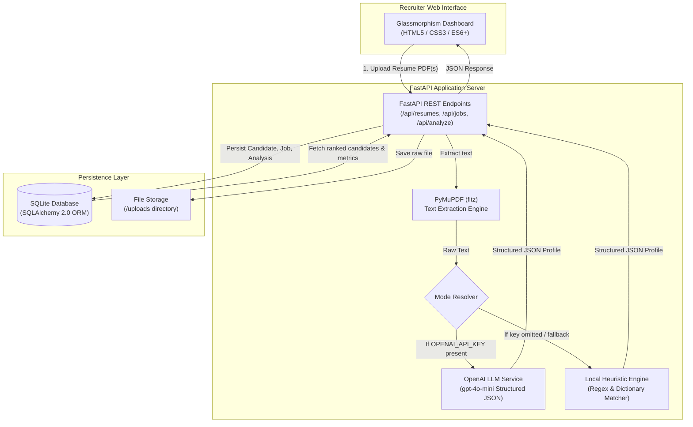
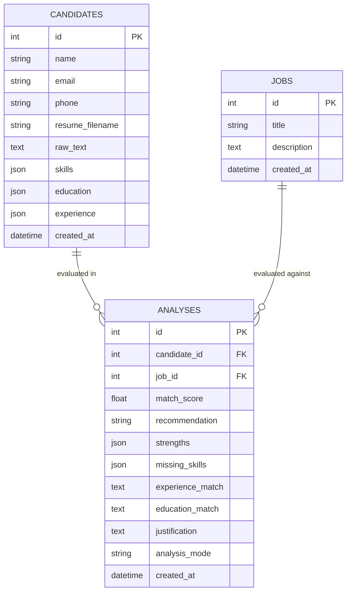

<div align="center">

# ⚡ RESUME HUB*
### Intelligent AI Candidate Screener & Resume Evaluation Platform

[](https://fastapi.tiangolo.com)
[](https://www.python.org/)
[](https://pymupdf.readthedocs.io/)
[](https://platform.openai.com/)
[](https://www.sqlalchemy.org/)
[](LICENSE)

<p align="center">
  <strong>Automated PDF Parsing &bull; Multi-Attribute Semantic Extraction &bull; LLM & Heuristic Match Scoring &bull; High-Velocity Shortlisting</strong>
</p>

[Key Features](#-key-features) &bull; [Video Demo](#-interactive-video-demonstration) &bull; [Architecture](#-system-architecture) &bull; [Quickstart](#-quick-start--installation) &bull; [API Docs](#-rest-api-reference) &bull; [LLM Prompts](#-llm-prompt-architecture) &bull; [Roadmap](#-project-roadmap)

</div>

---

## 📽️ Interactive Video Demonstration

> [!NOTE]
> ### 🎬 Live System Walkthrough
> High-velocity candidate resume evaluation, structured entity parsing, and semantic matching against job criteria in real-time.

<div align="center">
  <video src="Demo_Video.mp4" autoplay="autoplay" loop="loop" muted="muted" playsinline="playsinline" controls="controls" width="100%" style="max-height: 520px; border-radius: 12px; box-shadow: 0 10px 30px rgba(0,0,0,0.5);">
    <source src="Demo_Video.mp4" type="video/mp4">
    <source src="https://github.com/MohammadKadir/Smart-Resume-Scanner/raw/main/Demo_Video.mp4" type="video/mp4">
    Your browser does not support the video tag.
  </video>
</div>

![[Demo_Video.mp4]]

---

## 🚀 Key Features

> [!TIP]
> **Dual Operational Engines: AI Mode & Zero-Config Demo Mode**
> - **AI Mode (OpenAI GPT-4o-mini)**: Uses semantic embeddings and advanced reasoning for contextual understanding (e.g., recognizing that `Spring Boot` fulfills `Java backend framework` or `PyTorch` fulfills `Deep Learning experience`).
> - **Demo Mode (Local Heuristic NLP)**: Runs completely **offline with zero API keys required**. Uses regex tokenizers and rule-based semantic dictionaries to parse resumes and score candidates out-of-the-box.

- 📄 **High-Performance PDF Text Extraction**: Powered by **PyMuPDF (`fitz`)**, seamlessly extracting clean text from single/multi-page resumes while handling complex layouts, font variations, and formatting anomalies.
- 🧬 **Structured Profile Extraction**: Automatically parses unstructured raw text into clean, typed entities: **Contact Info, Technical & Soft Skills, Educational History, and Work Experience**.
- 🎯 **Semantic Match Scoring (1.0 – 10.0 Scale)**:
  - 🟢 **8.0 – 10.0**: **Strong Match** *(Recommended for immediate interview shortlist)*
  - 🟡 **6.0 – 7.9**: **Consider** *(Candidate meets core criteria with minor skill gaps)*
  - 🔴 **1.0 – 5.9**: **Weak Match** *(Significant requirement gaps or misaligned experience)*
- 📝 **Executive Justifications & Gap Analysis**: Generates transparent, human-readable rationales highlighting candidate strengths, matched competencies, and missing requirements.
- 🗄️ **Relational Persistence**: Stores parsed candidates, job descriptions, and evaluation histories in **SQLite** via **SQLAlchemy 2.0 ORM**.
- 🎨 **Modern Glassmorphism UI Dashboard**: Sleek, responsive recruiter web interface featuring drag-and-drop file upload, real-time status banners, candidate filter tabs, instant search, and full profile modal inspectors.
- ⚡ **Interactive Swagger & OpenAPI Documentation**: Complete interactive REST API playground at `/docs`.

---

## 🏗️ System Architecture



---

## 📊 Evaluation & Scoring Rubric

| Match Score | Recommendation | Badge Color | Recruiter Action | Description |
|:---:|:---:|:---:|:---:|:---|
| **8.0 – 10.0** | **Strong Match** | 🟢 Green | **Shortlist** | Candidate exceeds or closely satisfies all required technical skills, domain experience, and educational criteria. |
| **6.0 – 7.9** | **Consider** | 🟡 Yellow | **Review** | Candidate has strong foundational skills and relevant background, but possesses minor gaps in specific tooling or seniority. |
| **1.0 – 5.9** | **Weak Match** | 🔴 Red | **Archive** | Significant divergence between candidate qualifications and target job requirements. |

---

## 💻 Technology Stack

| Domain | Technology / Library | Role & Purpose |
|:---|:---|:---|
| **Backend Framework** | [FastAPI](https://fastapi.tiangolo.com/) | High-concurrency asynchronous REST API server |
| **Server Runtime** | [Uvicorn](https://www.uvicorn.org/) | Lightning-fast ASGI web server |
| **PDF Extraction** | [PyMuPDF (`fitz`)](https://pymupdf.readthedocs.io/) | High-speed C-based PDF text parsing and extraction |
| **Generative AI** | [OpenAI Python SDK](https://platform.openai.com/) | Semantic resume evaluation via `gpt-4o-mini` |
| **Local Fallback Engine** | Python NLP / Regular Expressions | Zero-dependency heuristic candidate parser and matcher |
| **ORM & Database** | [SQLAlchemy 2.0](https://www.sqlalchemy.org/) / SQLite3 | Relational database modeling, migrations, and queries |
| **Data Validation** | [Pydantic v2](https://docs.pydantic.dev/) | Strict request/response payload typing and validation |
| **Frontend UI** | HTML5, Modern CSS (Glassmorphism), Vanilla JS | Responsive, dependency-free recruiter dashboard |
| **Typography & Icons** | Outfit, Inter, FontAwesome 6 | Clean design system and iconography |

---

## 📁 Project Structure

```text
Smart-Resume-Scanner/
│
├── app/
│   ├── __init__.py
│   ├── main.py                  # FastAPI application entry point, middleware & route mount
│   ├── config.py                # Environment configuration & engine mode detection
│   ├── database.py              # SQLite engine initialization & SQLAlchemy session factory
│   ├── models.py                # SQLAlchemy DB models (Candidate, Job, Analysis)
│   ├── schemas.py               # Pydantic schemas for request validation & API responses
│   │
│   ├── routes/
│   │   ├── __init__.py
│   │   ├── candidates.py        # Resume upload, candidate listing & profile detail endpoints
│   │   ├── jobs.py              # Job description creation, template seeding & listing
│   │   ├── analysis.py          # Candidate matching, scoring & batch evaluation routes
│   │   └── system.py            # System healthcheck, active mode status & diagnostics
│   │
│   └── services/
│       ├── __init__.py
│       ├── pdf_service.py       # PyMuPDF text extraction & document sanitization
│       ├── llm_service.py       # OpenAI GPT-4o-mini structured JSON prompt engine
│       └── fallback_service.py  # Local heuristic rule-based parsing & scoring engine
│
├── static/
│   ├── index.html               # Main single-page recruiter dashboard
│   ├── css/
│   │   └── style.css            # Dark glassmorphism design system & micro-animations
│   └── js/
│       └── app.js               # Reactive frontend controller, state management & API client
│
├── sample_resumes/              # Pre-generated sample PDF resumes across tech roles
├── uploads/                     # Server storage directory for uploaded PDF resumes
├── generate_samples.py          # Synthetic PDF resume generator script for testing
├── reset_db.py                  # Database reset & initialization utility
├── requirements.txt             # Python project dependencies
├── .env.example                 # Environment configuration template
├── .gitignore                   # Git exclusion rules
├── Demo_Video.mp4               # System demonstration video
└── README.md                    # Project documentation
```

---

## ⚡ Quick Start & Installation

### 1. Clone the Repository
```bash
git clone https://github.com/MohammadKadir/Smart-Resume-Scanner.git
cd Smart-Resume-Scanner
```

### 2. Create and Activate Virtual Environment
```bash
# Windows
python -m venv venv
venv\Scripts\activate

# macOS / Linux
python3 -m venv venv
source venv/bin/activate
```

### 3. Install Dependencies
```bash
pip install -r requirements.txt
```

### 4. Configure Environment Variables
Copy `.env.example` to create your local `.env`:
```bash
# Windows PowerShell
Copy-Item .env.example .env

# macOS / Linux
cp .env.example .env
```

> [!IMPORTANT]
> **Setting up AI Mode vs. Demo Mode**
> - **To run with OpenAI AI Mode**: Edit `.env` and set `OPENAI_API_KEY=sk-your-openai-key`.
> - **To run with Local Demo Mode**: Leave `OPENAI_API_KEY=` empty. The app automatically detects this and activates the offline Heuristic NLP matching engine!

### 5. Generate Test Sample PDFs (Optional)
Generate synthetic test resumes for Data Scientist, Frontend Engineer, Java Developer, and DevOps roles:
```bash
python generate_samples.py
```

### 6. Run the Application Server
```bash
python -m uvicorn app.main:app --reload --port 8000
```

Once running, navigate to:
- 🌐 **Recruiter Dashboard**: [http://127.0.0.1:8000/](http://127.0.0.1:8000/)
- 📖 **Interactive Swagger API Docs**: [http://127.0.0.1:8000/docs](http://127.0.0.1:8000/docs)
- 📑 **ReDoc Documentation**: [http://127.0.0.1:8000/redoc](http://127.0.0.1:8000/redoc)

---

## 📡 REST API Reference

| Method | Endpoint | Description | Request Payload | Response |
|:---|:---|:---|:---|:---|
| `GET` | `/api/system/status` | System health and active AI/Demo mode | None | `{ "status": "online", "mode": "ai" \| "demo" }` |
| `POST` | `/api/resumes/upload` | Upload single or batch PDF resumes | `multipart/form-data` | List of parsed `CandidateResponse` objects |
| `GET` | `/api/resumes` | Retrieve all parsed candidates | None | `Array<CandidateResponse>` |
| `GET` | `/api/resumes/{candidate_id}` | Get complete candidate profile by ID | Path parameter | `CandidateResponse` with skills & experience |
| `POST` | `/api/jobs` | Create a new target Job Description | `{ "title": str, "description": str }` | `JobResponse` with assigned `id` |
| `GET` | `/api/jobs` | List all saved job descriptions | None | `Array<JobResponse>` |
| `POST` | `/api/analyze` | Run evaluation between candidate & job | `{ "candidate_id": int, "job_id": int }` | Full `AnalysisResponse` object |
| `GET` | `/api/analysis/job/{job_id}` | Get all ranked evaluations for a job | Path parameter | Sorted list of scored candidates |

---

## 🧠 LLM Prompt Architecture

> [!NOTE]
> ### Structured Prompting for Deterministic JSON Parsing
> Smart Resume Screener employs strict JSON Schema constraints in its system prompts to ensure consistent evaluations:

### 1. Resume Parsing Prompt
```text
You are an expert HR AI assistant specializing in resume parsing.
Analyze the raw text extracted from a candidate's resume and return a valid JSON object matching this schema:
{
  "name": "Candidate Full Name",
  "email": "Candidate Email Address",
  "phone": "Candidate Phone Number",
  "skills": ["Skill 1", "Skill 2", ...],
  "education": [
    {"degree": "Degree Title", "institution": "University/College", "year": "Year"}
  ],
  "experience": [
    {"company": "Company Name", "role": "Job Title", "duration": "Years/Months", "summary": "Role Summary"}
  ]
}
```

### 2. Semantic Evaluation Prompt
```text
You are an expert Talent Acquisition & Technical Recruiter AI.
Evaluate the Candidate Profile against the target Job Description:

1. Perform semantic matching (e.g., infer that FastAPI knowledge satisfies Python web framework requirements).
2. Assign a numerical Match Score from 1.0 to 10.0.
3. Categorize Recommendation into: "Strong Match" (8.0-10.0), "Consider" (6.0-7.9), or "Weak Match" (1.0-5.9).
4. Identify Key Strengths that match the job description.
5. Identify Missing Skills or gaps.
6. Provide an Executive Justification paragraph explaining the score.

Return strictly valid JSON with keys: match_score, recommendation, strengths, missing_skills, experience_match, education_match, justification.
```

---

## 🗄️ Database Schema



---

## ❓ Troubleshooting & FAQs

<details>
<summary><strong>What happens if I don't have an OpenAI API Key?</strong></summary>
<br/>
The system automatically falls back to the internal <strong>Heuristic NLP Engine</strong>. You can test and run all features (uploading PDFs, extracting skills, calculating match scores, and shortlisting) completely free with zero setup.
</details>

<details>
<summary><strong>How does the system handle multi-page or scanned PDFs?</strong></summary>
<br/>
PyMuPDF (<code>fitz</code>) extracts textual streams across all pages while preserving block order. For optimal extraction, ensure uploaded PDFs have selectable text.
</details>

<details>
<summary><strong>How do I reset or clear the database?</strong></summary>
<br/>
Simply run the provided reset script:
<pre><code>python reset_db.py</code></pre>
This recreates the SQLite schema and clears previously uploaded files.
</details>

---

## 🗺️ Project Roadmap

- [x] High-precision PDF text extraction with PyMuPDF
- [x] Dual-mode engine (OpenAI GPT-4o-mini + local heuristic NLP fallback)
- [x] 1.0 - 10.0 semantic scoring with category shortlists
- [x] Dark glassmorphism recruiter dashboard
- [x] Interactive Swagger OpenAPI documentation
- [x] SQLite relational storage with SQLAlchemy ORM
- [ ] Multi-format resume parsing (DOCX, TXT, RTF)
- [ ] Export shortlists to CSV / Excel / PDF reports
- [ ] Batch email notification dispatch to shortlisted candidates
- [ ] Custom weights for skill vs. experience vs. education scoring

---

## 📄 License

This project is licensed under the **MIT License** — see the [LICENSE](LICENSE) file for details.

---

<div align="center">
  <sub>Built with ❤️ by <a href="https://github.com/MohammadKadir">Mohammad Kadir</a> &bull; Powered by FastAPI & OpenAI</sub>
</div>